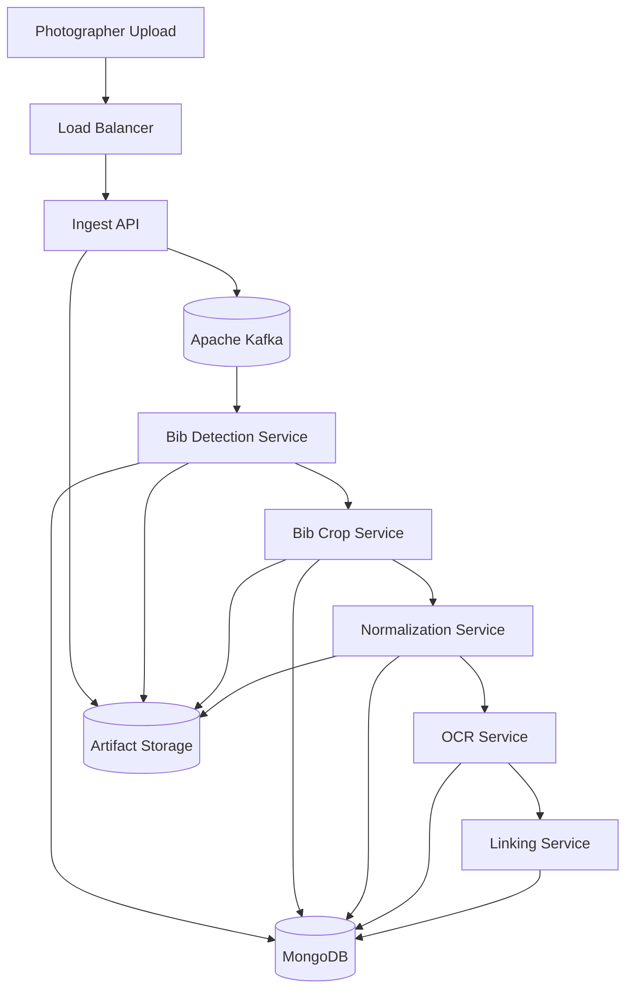
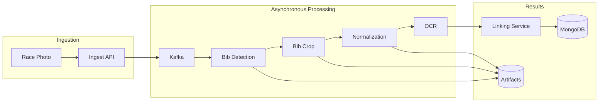

# Race Bib Recognition Platform


## Overview

Race Bib Recognition Platform is an event-driven computer vision platform that automatically detects and recognizes race bib numbers from running event photos.

The system processes uploaded race photos through independent asynchronous stages: bib detection, cropping, image normalization, OCR, and result linking.

The final output is a list of recognized bib numbers for each photo.

## Technology Stack

| Category | Technology |
|---|---|
| Language | Python latest stable |
| API Framework | FastAPI |
| Packaging | uv |
| Messaging | Apache Kafka |
| Local Runtime | Docker Compose |
| Local Kubernetes | kind or minikube |
| Container Platform | Kubernetes |
| Cloud Platform | Google Cloud Platform |
| Object Storage | Local storage for MVP, Google Cloud Storage for cloud deployment |
| Database | MongoDB |
| Computer Vision | OpenCV-compatible adapters |
| Object Detection | YOLO-compatible adapter |
| OCR | PaddleOCR-compatible adapter |
| Batch / Backfill Processing | Apache Beam / Google Dataflow |
| Observability | OpenTelemetry, Prometheus, Loki, Tempo, Grafana |
| Infrastructure as Code | Terraform |
| Documentation | MkDocs |

## Architecture Highlights

- Event-driven microservices architecture
- Metadata-only Kafka events
- Image artifacts stored outside Kafka
- Independent scaling of each processing stage
- Idempotent consumers
- Retry and Dead Letter Queue support
- End-to-end traceability using `jobId`
- Local-first development workflow
- Cloud deployment as a later phase
- Documentation-first project structure

## System Architecture



## Processing Pipeline



## Local Demo

Run the deterministic in-process demo:

```bash
uv run python scripts/demo_local_pipeline.py
```

Run the API locally:

```bash
uv run uvicorn rbp_ingest_api.app:app --reload --app-dir services/ingest-api/src
```

Run the async Docker path with Kafka and MongoDB:

```bash
uv run python scripts/run_docker_compose_e2e.py
```

Run tests:

```bash
uv run pytest
```

Validate local Kubernetes manifests:

```bash
uv run python scripts/validate_local_kubernetes.py
```

Run cloud deployment preflight:

```bash
uv run python scripts/cloud_preflight.py
```

## Documentation

Full documentation is available in the MkDocs site under `docs/`.

```bash
uv run mkdocs serve
```

## Roadmap

The roadmap progresses from local MVP to local orchestration, local Kubernetes, observability, reliability, model retraining, near-real-time processing, and final Google Cloud deployment.
