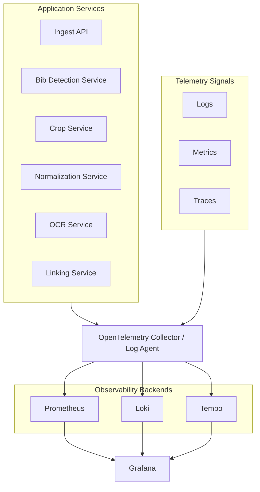

# Observability

Grafana visualizes metrics, logs, and traces.

## Required Dashboards

- Pipeline throughput
- End-to-end processing latency
- Per-stage latency
- Kafka consumer lag
- OCR confidence distribution
- Failed jobs
- DLQ message count
- Service health

## Instrumentation

The API exposes Prometheus text metrics at `/metrics`. Services can enable OpenTelemetry export with `RBP_OTEL_EXPORTER_OTLP_ENDPOINT`.
