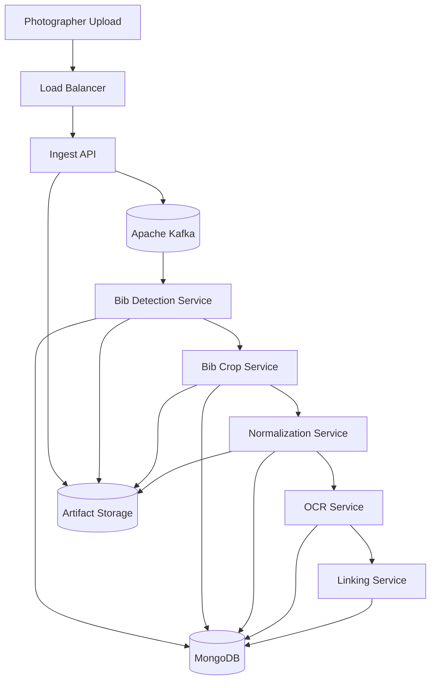

# Architecture Overview

The platform uses an asynchronous microservice pipeline. Each stage consumes one Kafka topic, persists state or artifacts, and emits the next event.

Kafka events contain metadata only. Image bytes are stored in artifact storage and referenced by URI.

## Service Boundaries

Each service owns one pipeline responsibility. Shared code is limited to stable contracts, generic infrastructure abstractions, and testable adapter protocols.

## Current Implementation

The repository includes a deterministic in-process runner for tests and demos. Docker Compose runs an async mode where the API writes MongoDB state and publishes Kafka events, while worker containers consume Kafka topics through service consumer groups. Kubernetes manifests and Terraform define the deployment shape for GKE and Google Cloud Storage.
