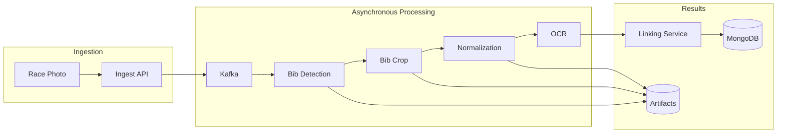

# Processing Pipeline

## Stage Contracts

| Stage | Input Topic | Output Topic | Artifact Output |
|---|---|---|---|
| Ingest | HTTP upload | `photo.ingested` | raw image |
| Detection | `photo.ingested` | `bib.detected` | optional debug overlays |
| Crop | `bib.detected` | `bib.cropped` | bib crops |
| Normalization | `bib.cropped` | `bib.normalized` | normalized crops |
| OCR | `bib.normalized` | `bib.ocr.completed` | OCR metadata |
| Linking | `bib.ocr.completed` | `result.linked` | final results |

## Idempotency

Consumers check persisted job state before creating duplicate stage outputs. Replayed events reuse existing records where possible.
