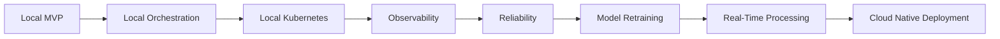

# Roadmap

## Phase 1: Local MVP

Local API, artifact storage, shared contracts, worker skeletons, fake detector/OCR adapters, and deterministic tests.

## Phase 2: Local Orchestration

Docker Compose defines Kafka, MongoDB, services, and observability dependencies for reproducible local startup.

## Phase 3: Local Kubernetes

Kubernetes manifests define the shape for kind or minikube with deployments, services, config, probes, and resources.

## Phase 4: Observability

Prometheus, Loki, Tempo, OpenTelemetry conventions, and Grafana dashboard documentation make the system inspectable.

## Phase 5: Reliability

Retry policy, DLQ naming, failure metadata, idempotent consumers, reprocessing scripts, and runbooks make failures recoverable.

## Phase 6: Model Retraining Pipeline

Low-confidence collection and dataset manifests define the loop for model improvement.

The local model evaluation loop uses `scripts/generate_dataset_manifest.py` for low-confidence sample manifests and `scripts/evaluate_model.py` for labeled prediction metrics.

## Phase 7: Real-Time Processing

Live status abstractions and latency-focused architecture support near-real-time demos.

## Phase 8: Cloud Native Deployment

Terraform and deployment docs define the Google Cloud, GKE, and GCS deployment path without committing credentials.
