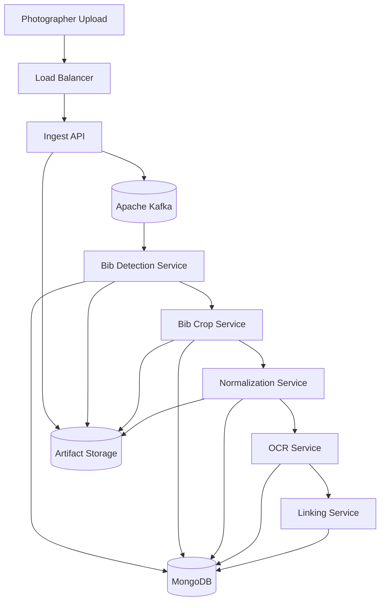
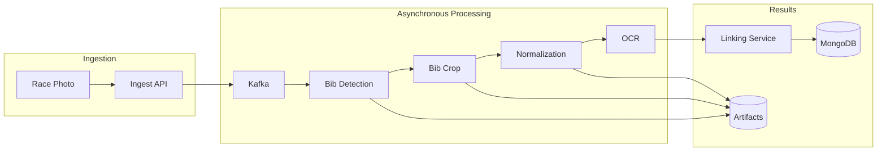
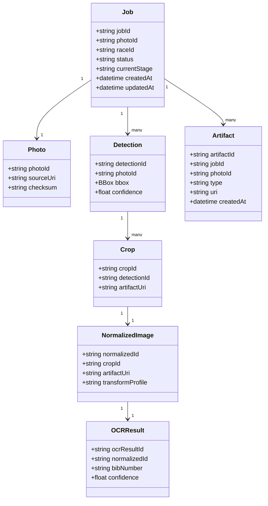
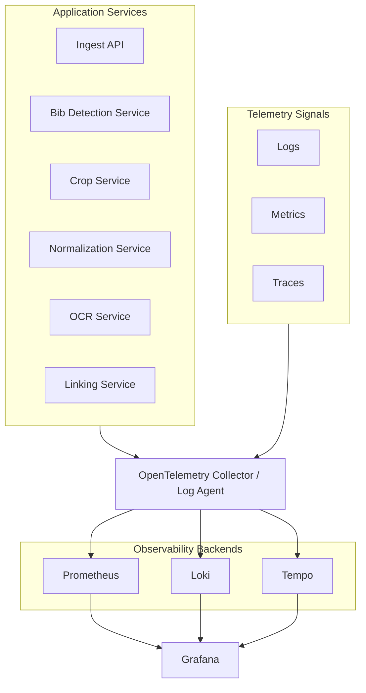
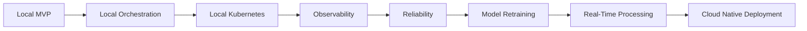

# Race Bib Recognition Platform — Codex Implementation Brief

This document is the single source of truth for implementing the **Race Bib Recognition Platform**.

Codex must read this file first, then implement the project phase by phase. The project is intended as a public portfolio demo, so the repository must be clean, documented, reviewable, and easy to understand for recruiters, engineers, and architects.

---

## 1. Project Goal

Build an event-driven computer vision platform that automatically detects and recognizes race bib numbers from running event photos.

A photo may contain one or more runners. The system does **not** need to identify runners as people. The only required final output is the recognized race bib number or numbers visible in the photo.

The processing flow is:

1. Upload race photo.
2. Detect candidate race bib regions.
3. Crop detected bib regions.
4. Normalize cropped bib images for OCR.
5. Run OCR.
6. Store recognized bib numbers and link them back to the source photo.

The platform must be designed as an asynchronous microservice pipeline. Each processing step may take a different amount of time, so services must not block each other synchronously. Each stage should be independently scalable.

---

## 2. Product Constraints

### Required behavior

- Support one or more bib numbers per photo.
- Store intermediate artifacts for debugging and future model retraining.
- Keep Kafka events metadata-only. Do not send image bytes through Kafka.
- Use a shared `jobId` and `photoId` across the whole pipeline.
- Make all processing services idempotent.
- Keep the system local-first in early phases.
- Deploy to cloud only in the final roadmap phase.
- All public-facing project text and documentation must be in English.

### Explicitly out of scope for MVP

- Runner identity tracking.
- Matching the same person across photos.
- User authentication.
- Payment, registration, or race management features.
- Cloud deployment in early phases.
- Training a custom detection model from scratch.

### Important domain decision

Do **not** create a `Runner` entity. The platform only needs to output recognized bib numbers for each photo.

Correct final output shape:

```json
{
  "photoId": "photo-abc123",
  "results": [
    {
      "bibNumber": "1258",
      "confidence": 0.97
    },
    {
      "bibNumber": "3421",
      "confidence": 0.91
    }
  ],
  "status": "COMPLETED"
}
```

---

## 3. Implementation Rules for Codex

### 3.1 Git rules

- The entire project must be maintained in Git.
- If the repository is not initialized, initialize it with `git init`.
- Every task must be delivered as a separate commit.
- Each commit must pass code review before continuing to the next task.
- Do not combine unrelated work in a single commit.
- Do not skip commit numbers.
- Do not rewrite approved commits unless explicitly requested.

Commit messages must use this exact format:

```text
RBP-0001: short imperative commit description
```

Examples:

```text
RBP-0001: initialize repository structure
RBP-0002: add MkDocs documentation skeleton
RBP-0003: add Kafka event envelope models
```

The `RBP-0001` number must increase by one for every new commit.

### 3.2 Code review workflow

After each commit:

1. Show the commit hash.
2. Summarize changed files.
3. Summarize tests or checks run.
4. Ask for code review approval before continuing.

If the owner explicitly approves phase-level auto-advance, Codex may continue through multiple commits inside the phase, but each commit still needs a clear summary.

### 3.3 Communication rules

Always inform the project owner when:

- a full roadmap phase is completed,
- a significant architectural decision is required,
- a technology trade-off must be made,
- implementation constraints prevent the original design,
- tests cannot be run,
- a dependency or tool is unavailable.

Do not make major architectural changes silently.

### 3.4 Agentic development rules

If the environment supports multiple agents and the work can be safely split:

- create or delegate to specialized agents,
- assign each agent a non-overlapping task,
- prevent multiple agents from editing the same files at the same time,
- require each agent to report changed files, tests run, and decisions made.

Good examples of split tasks:

- Documentation agent: MkDocs and README.
- API agent: FastAPI ingest service.
- Contracts agent: Kafka event schemas and shared models.
- Pipeline agent: worker service skeletons.
- DevOps agent: Docker Compose and local runtime.

If agent delegation is not available, split the work into explicit sequential tasks.

### 3.5 Documentation rules

- Documentation must be maintained with MkDocs.
- Public documentation must be written in English.
- Every service must have documentation describing:
  - responsibility,
  - input event,
  - output event,
  - configuration,
  - local run instructions,
  - test strategy.
- Architecture decisions must be documented as ADRs.
- README must stay recruiter-friendly and not become overloaded with implementation details.
- Detailed implementation instructions should live in `AGENTS.md` and `docs/development/`.

### 3.6 Code quality rules

- Keep services small and focused.
- Prefer clear, boring code over clever abstractions.
- Use typed Python.
- Add tests with every feature.
- Use shared libraries only for stable cross-service contracts.
- Do not leak service-specific logic into shared modules.
- Keep API models, Kafka event models, and MongoDB schemas documented.
- Do not commit secrets.
- Do not commit private or copyrighted race photos unless the owner explicitly confirms they are allowed for public use.

### 3.7 `.gitignore` policy

The repository must ignore local build outputs, virtual environments, local data, secrets, and AI-agent tooling files.

The `.gitignore` must include at least:

```gitignore
# Python
.venv/
__pycache__/
*.pyc
.pytest_cache/
.ruff_cache/
.mypy_cache/
.coverage
htmlcov/

# Local environment
.env
.env.*
!.env.example

# IDE
.idea/
.vscode/

# Local data and artifacts
data/
tmp/
.local/
artifacts/

# Docker / local runtime
.docker-data/

# MkDocs
site/

# AI agent local tooling
superpowers/
.superpowers/
.codex/
.agent/
.agent-cache/
.ai/
*.agent.local.md
*.codex.local.md
```

---

## 4. Technology Stack

Use the latest stable versions available at implementation time. Do not use pre-release versions unless explicitly approved by the project owner.

| Category | Technology |
|---|---|
| Language | Python 3.14+ or latest stable Python |
| API Framework | FastAPI |
| Python Packaging | uv |
| Messaging | Apache Kafka |
| Local Runtime | Docker Compose |
| Local Kubernetes | kind or minikube |
| Container Platform | Kubernetes |
| Cloud Platform | Google Cloud Platform |
| Object Storage | Local artifact storage for MVP, Google Cloud Storage for cloud deployment |
| Database | MongoDB |
| Computer Vision | OpenCV |
| Object Detection | YOLO-compatible adapter |
| OCR | PaddleOCR-compatible adapter |
| Batch / Backfill Processing | Apache Beam / Google Dataflow, later phase only |
| Metrics | Prometheus |
| Logs | Loki |
| Traces | Tempo |
| Telemetry | OpenTelemetry |
| Dashboards | Grafana |
| Infrastructure as Code | Terraform, cloud phase only |
| Documentation | MkDocs |

### Technology guidance

- Do not force every technology into Phase 1.
- Build a local working pipeline first.
- Add cloud-native infrastructure later.
- Use adapters for detection and OCR so models can be swapped later.
- Do not use Elasticsearch.
- Do not introduce OpenSearch unless explicitly approved later.
- Logs should go to Loki in the planned observability phase.

---

## 5. Recommended Repository Structure

Use a monorepo.

```text
.
├── README.md
├── AGENTS.md
├── mkdocs.yml
├── pyproject.toml
├── uv.lock
├── .gitignore
├── .env.example
├── docs/
│   ├── index.md
│   ├── architecture/
│   │   ├── overview.md
│   │   ├── pipeline.md
│   │   ├── kafka.md
│   │   ├── mongodb.md
│   │   ├── api.md
│   │   ├── observability.md
│   │   └── decisions/
│   │       ├── ADR-0001-event-driven-kafka.md
│   │       ├── ADR-0002-artifact-first-design.md
│   │       ├── ADR-0003-mongodb-aggregate-model.md
│   │       ├── ADR-0004-local-first-development.md
│   │       ├── ADR-0005-loki-for-logs.md
│   │       └── ADR-0006-no-runner-entity.md
│   ├── development/
│   │   ├── local-setup.md
│   │   ├── testing.md
│   │   ├── codex-rules.md
│   │   └── coding-standards.md
│   ├── operations/
│   │   ├── runbooks.md
│   │   └── troubleshooting.md
│   └── roadmap.md
├── libs/
│   └── rbp-contracts/
│       ├── pyproject.toml
│       └── src/rbp_contracts/
│           ├── __init__.py
│           ├── events.py
│           ├── ids.py
│           ├── models.py
│           └── statuses.py
├── services/
│   ├── ingest-api/
│   ├── bib-detection-service/
│   ├── crop-service/
│   ├── normalization-service/
│   ├── ocr-service/
│   └── linking-service/
├── infra/
│   ├── docker-compose/
│   ├── k8s/
│   ├── helm/
│   └── terraform/
├── scripts/
├── samples/
│   ├── README.md
│   └── photos/
└── tests/
    ├── unit/
    ├── integration/
    └── e2e/
```

Notes:

- `libs/rbp-contracts` should contain shared contracts only.
- Services must not share internal business logic through the shared library.
- `infra/terraform` is reserved for the final cloud phase.
- `samples/photos` must only contain public or owner-approved images.

---

## 6. README Skeleton

Create a recruiter-friendly `README.md` using the following structure.

```markdown
# Race Bib Recognition Platform


## Overview

Race Bib Recognition Platform is an event-driven computer vision platform that automatically detects and recognizes race bib numbers from running event photos.

The system processes uploaded race photos through independent asynchronous stages: bib detection, cropping, image normalization, OCR, and result linking.

The final output is a list of recognized bib numbers for each photo.

## Technology Stack

| Category | Technology |
|---|---|
| Language | Python latest stable |
| API Framework | FastAPI |
| Packaging | uv |
| Messaging | Apache Kafka |
| Local Runtime | Docker Compose |
| Local Kubernetes | kind or minikube |
| Container Platform | Kubernetes |
| Cloud Platform | Google Cloud Platform |
| Object Storage | Local storage for MVP, Google Cloud Storage for cloud deployment |
| Database | MongoDB |
| Computer Vision | OpenCV |
| Object Detection | YOLO-compatible adapter |
| OCR | PaddleOCR-compatible adapter |
| Batch / Backfill Processing | Apache Beam / Google Dataflow |
| Observability | OpenTelemetry, Prometheus, Loki, Tempo, Grafana |
| Infrastructure as Code | Terraform |
| Documentation | MkDocs |

## Architecture Highlights

- Event-driven microservices architecture
- Metadata-only Kafka events
- Image artifacts stored outside Kafka
- Independent scaling of each processing stage
- Idempotent consumers
- Retry and Dead Letter Queue support
- End-to-end traceability using `jobId`
- Local-first development workflow
- Cloud deployment as a later phase
- Documentation-first project structure

## System Architecture

[Mermaid diagram here]

## Processing Pipeline

[Mermaid diagram here]

## Documentation

Full documentation is available in the MkDocs site under `docs/`.

## Roadmap

[Roadmap summary here]
```

---

## 7. System Architecture Diagram

Use this Mermaid diagram in README and MkDocs.



---

## 8. Processing Pipeline Diagram

Use this Mermaid diagram in README and MkDocs.



---

## 9. Domain Model

Use this as the conceptual model. The actual MongoDB document may embed detections, crops, OCR results, and final results inside the `processing_jobs` collection.



---

## 10. Kafka Event Model

Kafka is the asynchronous event backbone of the platform.

Each service consumes one event type, performs its processing step, persists metadata or artifacts, and emits the next event.

### 10.1 Event design principles

- Kafka events contain metadata only.
- Image bytes are never sent through Kafka.
- All events include `jobId` and `photoId`.
- Services are idempotent.
- Kafka partitioning should use `photoId`.
- Replay is supported through Kafka offsets and persisted artifacts.
- Long-term reprocessing must use persisted artifacts and MongoDB state, not Kafka retention alone.
- Fan-out is supported through independent consumer groups.

### 10.2 Topics

| Topic | Produced By | Consumed By |
|---|---|---|
| `photo.ingested` | Ingest API | Bib Detection Service |
| `bib.detected` | Bib Detection Service | Bib Crop Service |
| `bib.cropped` | Bib Crop Service | Normalization Service |
| `bib.normalized` | Normalization Service | OCR Service |
| `bib.ocr.completed` | OCR Service | Linking Service, Analytics Service, Retraining Candidate Collector |
| `result.linked` | Linking Service | Optional downstream consumers |
| `pipeline.failed` | Any service | Retry / diagnostics workflows |

### 10.3 Common event envelope

```json
{
  "eventId": "evt-001",
  "eventType": "photo.ingested",
  "jobId": "job-2026-000001",
  "photoId": "photo-abc123",
  "timestamp": "2026-06-13T10:15:30Z",
  "source": "ingest-api",
  "payload": {}
}
```

### 10.4 Event examples

#### `photo.ingested`

```json
{
  "eventId": "evt-001",
  "eventType": "photo.ingested",
  "jobId": "job-2026-000001",
  "photoId": "photo-abc123",
  "timestamp": "2026-06-13T10:15:30Z",
  "source": "ingest-api",
  "payload": {
    "imageUri": "file://artifacts/jobs/job-2026-000001/raw/photo-abc123.jpg"
  }
}
```

#### `bib.detected`

Detection events contain bounding boxes only. Crop artifacts are created later by the Crop Service.

```json
{
  "eventId": "evt-002",
  "eventType": "bib.detected",
  "jobId": "job-2026-000001",
  "photoId": "photo-abc123",
  "timestamp": "2026-06-13T10:15:41Z",
  "source": "bib-detection-service",
  "payload": {
    "detections": [
      {
        "detectionId": "det-1",
        "bbox": [120, 220, 310, 415],
        "confidence": 0.94
      }
    ]
  }
}
```

#### `bib.cropped`

```json
{
  "eventId": "evt-003",
  "eventType": "bib.cropped",
  "jobId": "job-2026-000001",
  "photoId": "photo-abc123",
  "timestamp": "2026-06-13T10:15:45Z",
  "source": "crop-service",
  "payload": {
    "crops": [
      {
        "cropId": "crop-1",
        "detectionId": "det-1",
        "artifactUri": "file://artifacts/jobs/job-2026-000001/crops/crop-1.jpg"
      }
    ]
  }
}
```

#### `bib.normalized`

```json
{
  "eventId": "evt-004",
  "eventType": "bib.normalized",
  "jobId": "job-2026-000001",
  "photoId": "photo-abc123",
  "timestamp": "2026-06-13T10:15:50Z",
  "source": "normalization-service",
  "payload": {
    "normalizedImages": [
      {
        "normalizedId": "norm-1",
        "cropId": "crop-1",
        "artifactUri": "file://artifacts/jobs/job-2026-000001/normalized/norm-1.jpg",
        "transformProfile": "default-v1"
      }
    ]
  }
}
```

#### `bib.ocr.completed`

```json
{
  "eventId": "evt-005",
  "eventType": "bib.ocr.completed",
  "jobId": "job-2026-000001",
  "photoId": "photo-abc123",
  "timestamp": "2026-06-13T10:15:55Z",
  "source": "ocr-service",
  "payload": {
    "results": [
      {
        "ocrResultId": "ocr-1",
        "normalizedId": "norm-1",
        "bibNumber": "1258",
        "confidence": 0.97
      }
    ]
  }
}
```

#### `result.linked`

```json
{
  "eventId": "evt-006",
  "eventType": "result.linked",
  "jobId": "job-2026-000001",
  "photoId": "photo-abc123",
  "timestamp": "2026-06-13T10:16:00Z",
  "source": "linking-service",
  "payload": {
    "finalResults": [
      {
        "bibNumber": "1258",
        "confidence": 0.97,
        "ocrResultId": "ocr-1"
      }
    ]
  }
}
```

#### `pipeline.failed`

```json
{
  "eventId": "evt-999",
  "eventType": "pipeline.failed",
  "jobId": "job-2026-000001",
  "photoId": "photo-abc123",
  "timestamp": "2026-06-13T10:16:10Z",
  "source": "ocr-service",
  "payload": {
    "stage": "OCR",
    "errorCode": "OCR_EMPTY_RESULT",
    "message": "No readable bib number found"
  }
}
```

### 10.5 Kafka replay

Replay means existing events can be consumed again.

Supported replay patterns:

1. Create a new consumer group and read a topic from the beginning or from a selected offset.
2. Reset offsets for an existing consumer group.
3. Reprocess jobs from persisted raw images and artifacts.

Use cases:

- debugging,
- reprocessing after OCR improvements,
- comparing model versions,
- building analytics,
- collecting retraining candidates.

Kafka replay is useful, but do not treat Kafka as the long-term source of truth. Long-term reprocessing must rely on persisted artifacts and job metadata.

### 10.6 Kafka consumer groups and load balancing

Kafka load balancing happens through partitions and consumer groups.

Rules:

- A topic has one or more partitions.
- Within one consumer group, one partition is consumed by at most one consumer instance at a time.
- Multiple service instances in the same consumer group share the partitions.
- If more instances are added, Kafka performs a rebalance.
- If there are more consumers than partitions, some consumers will be idle.
- Ordering is preserved only within a single partition.

Example:

```text
Topic: bib.normalized
Partitions: 6
Consumer group: ocr-service

OCR instance 1 -> partitions 0, 1
OCR instance 2 -> partitions 2, 3
OCR instance 3 -> partitions 4, 5
```

This allows the OCR service to scale horizontally by adding more pods, as long as the topic has enough partitions.

### 10.7 Event streaming and analytics

Kafka should be used as an event stream, not just a queue.

The event stream creates a chronological record of the pipeline:

```text
photo.ingested -> bib.detected -> bib.cropped -> bib.normalized -> bib.ocr.completed -> result.linked
```

Analytics services can consume the same events using their own consumer groups without blocking the production pipeline.

Possible analytics:

- photos processed per minute,
- per-stage latency,
- OCR confidence distribution,
- failed job counts,
- DLQ counts,
- model quality trends,
- retraining candidate volume.

### 10.8 Fan-out after OCR

After `bib.ocr.completed`, multiple services can consume the same event independently.

```text
bib.ocr.completed
    ├── Linking Service
    ├── Analytics Service
    ├── Model Quality Service
    └── Retraining Candidate Collector
```

Each service must use its own Kafka consumer group.

Kafka does not call these services directly. The services subscribe to the topic and consume events independently.

---

## 11. MongoDB Data Model

Use MongoDB as the operational state store.

Recommended collections:

| Collection | Purpose |
|---|---|
| `processing_jobs` | Main pipeline state, stage progress, detections, OCR results, final results |
| `artifacts` | References to raw images, crops, normalized images, and debug outputs |

### 11.1 `processing_jobs` example

```json
{
  "_id": "job-2026-000001",
  "jobId": "job-2026-000001",
  "raceId": "race-2026-prague-half",
  "photoId": "photo-abc123",
  "sourceImageUri": "file://artifacts/jobs/job-2026-000001/raw/photo-abc123.jpg",
  "status": "COMPLETED",
  "currentStage": "LINKING",
  "createdAt": "2026-06-13T10:15:30Z",
  "updatedAt": "2026-06-13T10:16:00Z",
  "pipeline": {
    "ingestedAt": "2026-06-13T10:15:30Z",
    "detectedAt": "2026-06-13T10:15:41Z",
    "croppedAt": "2026-06-13T10:15:45Z",
    "normalizedAt": "2026-06-13T10:15:50Z",
    "ocrCompletedAt": "2026-06-13T10:15:55Z",
    "linkedAt": "2026-06-13T10:16:00Z"
  },
  "detections": [
    {
      "detectionId": "det-1",
      "bbox": [120, 220, 310, 415],
      "confidence": 0.94
    }
  ],
  "crops": [
    {
      "cropId": "crop-1",
      "detectionId": "det-1",
      "artifactId": "art-crop-1"
    }
  ],
  "normalizedImages": [
    {
      "normalizedId": "norm-1",
      "cropId": "crop-1",
      "artifactId": "art-norm-1",
      "transformProfile": "default-v1"
    }
  ],
  "ocrResults": [
    {
      "ocrResultId": "ocr-1",
      "normalizedId": "norm-1",
      "bibNumber": "1258",
      "confidence": 0.97
    }
  ],
  "finalResults": [
    {
      "bibNumber": "1258",
      "confidence": 0.97,
      "ocrResultId": "ocr-1"
    }
  ],
  "errors": []
}
```

### 11.2 `artifacts` example

```json
{
  "_id": "art-crop-1",
  "artifactId": "art-crop-1",
  "jobId": "job-2026-000001",
  "photoId": "photo-abc123",
  "type": "bib_crop",
  "stage": "CROP",
  "uri": "file://artifacts/jobs/job-2026-000001/crops/crop-1.jpg",
  "contentType": "image/jpeg",
  "width": 640,
  "height": 256,
  "createdAt": "2026-06-13T10:15:45Z",
  "metadata": {
    "detectionId": "det-1"
  }
}
```

### 11.3 Status enum

```text
RECEIVED
DETECTING
CROPPING
NORMALIZING
OCRING
LINKING
COMPLETED
FAILED
```

### 11.4 Stage enum

```text
INGEST
DETECTION
CROP
NORMALIZATION
OCR
LINKING
```

### 11.5 Artifact type enum

```text
raw_image
bib_crop
normalized_crop
ocr_input
debug_overlay
```

### 11.6 Recommended indexes

Do not create a unique index on `photoId`. The same photo may be reprocessed in future model comparison or retraining workflows.

```javascript
db.processing_jobs.createIndex({ jobId: 1 }, { unique: true })
db.processing_jobs.createIndex({ photoId: 1, createdAt: -1 })
db.processing_jobs.createIndex({ raceId: 1, createdAt: -1 })
db.processing_jobs.createIndex({ status: 1, updatedAt: -1 })

db.artifacts.createIndex({ jobId: 1, stage: 1 })
db.artifacts.createIndex({ photoId: 1, type: 1 })
db.artifacts.createIndex({ uri: 1 }, { unique: true })
```

---

## 12. API Model

Keep the public API small.

### 12.1 Upload photo

```http
POST /v1/photos
```

Response:

```json
{
  "jobId": "job-2026-000001",
  "photoId": "photo-abc123",
  "status": "RECEIVED"
}
```

Internal behavior:

- store raw image in local artifact storage,
- create MongoDB job document,
- publish `photo.ingested` to Kafka.

### 12.2 Get job status

```http
GET /v1/jobs/{jobId}
```

Response:

```json
{
  "jobId": "job-2026-000001",
  "photoId": "photo-abc123",
  "status": "COMPLETED",
  "currentStage": "LINKING",
  "createdAt": "2026-06-13T10:15:30Z",
  "updatedAt": "2026-06-13T10:16:00Z"
}
```

### 12.3 Get photo results

```http
GET /v1/photos/{photoId}/results
```

Response:

```json
{
  "photoId": "photo-abc123",
  "results": [
    {
      "bibNumber": "1258",
      "confidence": 0.97
    },
    {
      "bibNumber": "3421",
      "confidence": 0.91
    }
  ],
  "status": "COMPLETED"
}
```

### 12.4 Get job details

```http
GET /v1/jobs/{jobId}/details
```

This endpoint is intended for debugging and demo visibility.

Response may include:

- detections,
- crop references,
- normalized image references,
- OCR results,
- final results,
- errors,
- artifact URIs.

---

## 13. Service Breakdown

### 13.1 Ingest API

Responsibility:

- accept photo uploads,
- create processing job,
- store raw image artifact,
- publish `photo.ingested`.

Notes:

- This is the only synchronous public entry point in the MVP.
- It must not perform computer vision work.

### 13.2 Bib Detection Service

Responsibility:

- consume `photo.ingested`,
- load the source image from artifact storage,
- detect candidate bib regions,
- persist detection metadata,
- publish `bib.detected`.

Notes:

- The domain service is named Bib Detection, not Runner Detection.
- Internally it may use person detection if useful, but this must not leak into the domain model.
- For early MVP, implement a pluggable detector adapter. A lightweight placeholder or heuristic detector is acceptable if the real model is too heavy for the first commit, but the architecture must allow replacing it with a YOLO-compatible implementation.

### 13.3 Bib Crop Service

Responsibility:

- consume `bib.detected`,
- crop detected bib regions,
- store crop artifacts,
- update job state,
- publish `bib.cropped`.

### 13.4 Normalization Service

Responsibility:

- consume `bib.cropped`,
- normalize cropped bib images for OCR,
- perform operations such as resizing, contrast enhancement, denoising, thresholding, or perspective correction when available,
- store normalized artifacts,
- publish `bib.normalized`.

### 13.5 OCR Service

Responsibility:

- consume `bib.normalized`,
- run OCR,
- produce bib number candidates with confidence,
- update job state,
- publish `bib.ocr.completed`.

Notes:

- Use a pluggable OCR adapter.
- PaddleOCR-compatible implementation is preferred when practical.
- Keep output limited to bib numbers and confidence metadata.

### 13.6 Linking Service

Responsibility:

- consume `bib.ocr.completed`,
- build final result list,
- update `processing_jobs.finalResults`,
- set final job status,
- publish `result.linked`.

### 13.7 Retry / DLQ Worker

Responsibility:

- inspect failed messages,
- expose manual or scripted reprocessing workflows,
- support future operational runbooks.

This can be implemented after the basic pipeline works.

---

## 14. Artifact Storage

### 14.1 Design principles

- Store image data outside Kafka.
- Store raw images and intermediate artifacts.
- Use deterministic paths based on `jobId`.
- Persist artifacts before publishing the downstream event.
- Allow reprocessing without re-uploading the original photo.

### 14.2 Local artifact path layout

```text
artifacts/
  jobs/
    job-2026-000001/
      raw/
        photo-abc123.jpg
      crops/
        crop-1.jpg
        crop-2.jpg
      normalized/
        norm-1.jpg
        norm-2.jpg
      debug/
        detection-overlay.jpg
```

### 14.3 Cloud artifact path layout

Future cloud deployment should map the same logical layout to Google Cloud Storage:

```text
gs://race-bib-platform/jobs/job-2026-000001/raw/photo-abc123.jpg
gs://race-bib-platform/jobs/job-2026-000001/crops/crop-1.jpg
gs://race-bib-platform/jobs/job-2026-000001/normalized/norm-1.jpg
```

### 14.4 Implementation guidance

Create an artifact storage abstraction early:

```text
ArtifactStore
  ├── LocalArtifactStore
  └── GcsArtifactStore, later phase
```

Implement `LocalArtifactStore` first.

---

## 15. Observability & Monitoring

Grafana is required.

Use this target stack:

| Signal | Tool |
|---|---|
| Metrics | Prometheus |
| Logs | Loki |
| Traces | Tempo |
| Instrumentation | OpenTelemetry |
| Dashboards | Grafana |

Do not use Kafka to collect logs.
Do not use Prometheus to collect logs.
Prometheus is for metrics.
Loki is for logs.
Tempo is for traces.
Grafana visualizes all of them.

### 15.1 Observability diagram



### 15.2 Required dashboards

At minimum, create dashboard documentation for:

- pipeline throughput,
- end-to-end processing latency,
- per-stage latency,
- Kafka consumer lag,
- OCR confidence distribution,
- failed jobs,
- DLQ message count,
- service health.

Implementation of full dashboards may happen in the Observability phase.

---

## 16. Reliability

### 16.1 Principles

- All consumers must be idempotent.
- Each stage must support retries.
- Poison messages must be routed to DLQ topics.
- Artifacts must be persisted before downstream events are emitted.
- Jobs must be reprocessable without re-uploading the original photo.
- Failed jobs must include enough error metadata for debugging.

### 16.2 Dead Letter Topics

```text
photo.ingested.dlq
bib.detected.dlq
bib.cropped.dlq
bib.normalized.dlq
bib.ocr.completed.dlq
```

### 16.3 Failure metadata

Failures should include:

- `jobId`,
- `photoId`,
- stage,
- service name,
- error code,
- human-readable message,
- retry count,
- timestamp,
- original event reference if available.

---

## 17. Roadmap

Do not jump to cloud deployment early. The project must start locally, then gradually move toward local orchestration, local Kubernetes, observability, reliability, ML maturity, real-time processing, and finally cloud deployment.

### Phase 1 — Local MVP

Goal: Get the full pipeline running end-to-end on a developer machine.

Features:

- Photo upload API.
- Kafka-based event pipeline.
- Bib detection.
- Bib cropping.
- Image normalization.
- OCR processing.
- Result persistence in MongoDB.
- Local artifact storage.
- Sample input photos.
- Demo output.

Deliverables:

- Working local end-to-end pipeline.
- Dockerized services.
- Basic README.
- Initial MkDocs documentation.

### Phase 2 — Local Orchestration

Goal: Run the full system with reproducible local dependencies.

Features:

- Docker Compose setup.
- Local Kafka.
- Local MongoDB.
- Local artifact storage.
- Service-specific configuration.
- Local test data.

Deliverables:

- One-command local startup.
- Repeatable local demo.
- Clear service boundaries.

### Phase 3 — Local Kubernetes

Goal: Validate the Kubernetes shape before cloud deployment.

Features:

- kind or minikube deployment.
- Kubernetes manifests or Helm charts.
- ConfigMaps and Secrets.
- Health checks.
- Resource requests and limits.
- Basic horizontal scaling tests.

Deliverables:

- Repeatable local Kubernetes deployment.
- Local cluster demo.
- Kubernetes documentation.

### Phase 4 — Observability

Goal: Make the system inspectable and debuggable.

Features:

- OpenTelemetry instrumentation.
- Prometheus metrics.
- Loki log aggregation.
- Tempo distributed tracing.
- Grafana dashboards.

Deliverables:

- Pipeline latency dashboard.
- Kafka lag dashboard.
- OCR confidence dashboard.
- Failed jobs dashboard.
- End-to-end job tracing.

### Phase 5 — Reliability

Goal: Make failures visible and recoverable.

Features:

- Retry policies.
- Dead Letter Queues.
- Idempotent consumers.
- Failure handling.
- Health checks.
- Reprocessing workflow.

Deliverables:

- Stable failure recovery.
- DLQ inspection workflow.
- Operational runbooks.

### Phase 6 — Model Retraining Pipeline

Goal: Use low-confidence outputs to improve the model.

Features:

- Low-confidence sample collection.
- Dataset generation.
- Annotation workflow.
- Evaluation pipeline.
- Retraining experiments.
- Model version tracking.

Deliverables:

- Training dataset management.
- Model benchmarking.
- Accuracy improvement loop.

### Phase 7 — Real-Time Processing

Goal: Move toward near real-time race photo processing.

Features:

- Streaming ingestion improvements.
- Reduced end-to-end latency.
- Live job status updates.
- Real-time processing dashboard.

Deliverables:

- Near real-time OCR results.
- Live race processing demo.
- Low-latency event flow.

### Phase 8 — Cloud Native Deployment

Goal: Deploy the platform to Google Cloud Platform.

Features:

- GKE deployment.
- Google Cloud Storage integration.
- Terraform infrastructure.
- Cloud-ready secrets and configuration.
- Production-like scaling.
- Public portfolio demo environment.

Deliverables:

- Cloud deployment.
- Reproducible infrastructure.
- Public demo documentation.
- Final architecture write-up.

### Visual Roadmap



---

## 18. Suggested Initial Commit Plan

Start with Phase 1. Do not implement future phases before Phase 1 is complete.

Suggested commits:

```text
RBP-0001: initialize repository structure
RBP-0002: add gitignore and environment template
RBP-0003: add README skeleton
RBP-0004: add MkDocs documentation skeleton
RBP-0005: add Codex and agent development rules
RBP-0006: add shared Python contracts package
RBP-0007: add Kafka event envelope models
RBP-0008: add MongoDB data models
RBP-0009: add local artifact storage abstraction
RBP-0010: add FastAPI ingest service skeleton
RBP-0011: add Docker Compose dependencies
RBP-0012: add bib detection service skeleton
RBP-0013: add crop service skeleton
RBP-0014: add normalization service skeleton
RBP-0015: add OCR service skeleton
RBP-0016: add linking service skeleton
RBP-0017: wire local Kafka pipeline end to end
RBP-0018: add sample photo demo workflow
RBP-0019: add Phase 1 tests and documentation
```

Each task should be its own commit. If a task is too large, split it into smaller numbered commits.

---

## 19. Phase 1 Definition of Done

Phase 1 is complete only when all of the following are true:

- Repository is initialized in Git.
- README exists and is readable.
- MkDocs skeleton exists and can be served locally.
- Shared event contracts exist.
- MongoDB job and artifact models are documented and represented in code.
- Ingest API can create a job.
- Raw uploaded photo can be stored in local artifact storage.
- `photo.ingested` can be published.
- Worker services exist as runnable skeletons.
- A local end-to-end demo path exists, even if detection or OCR adapters are initially basic.
- Final API can return recognized bib number results as a list.
- Unit tests exist for shared contracts.
- Local run instructions are documented.
- Every task was committed separately with the `RBP-0001` style format.

---

## 20. Testing Strategy

### Unit tests

Cover:

- ID generation,
- event envelope validation,
- event payload validation,
- status transitions,
- artifact path generation,
- MongoDB document mapping,
- service handler logic with mocked dependencies.

### Integration tests

Cover:

- Ingest API creates job and stores artifact.
- Event publishing works.
- Worker consumes a sample event and emits next event.
- MongoDB updates are correct.

### E2E tests

Eventually cover:

- upload sample photo,
- run full pipeline,
- retrieve final result.

For early MVP, E2E tests may use lightweight fake detector and fake OCR adapters to validate architecture before heavy CV dependencies are fully integrated.

---

## 21. Architecture Decision Records

Create ADR files for important decisions.

Initial ADRs:

```text
ADR-0001-event-driven-kafka.md
ADR-0002-artifact-first-design.md
ADR-0003-mongodb-aggregate-model.md
ADR-0004-local-first-development.md
ADR-0005-loki-for-logs.md
ADR-0006-no-runner-entity.md
```

Each ADR should include:

- status,
- context,
- decision,
- consequences.

---

## 22. Security and Public Portfolio Notes

- Do not commit secrets.
- Provide `.env.example` only.
- Do not commit private data.
- Do not commit race photos unless they are public domain, synthetic, generated, or explicitly approved for public portfolio use.
- Keep cloud credentials out of the repository.
- Add documentation for how to run the demo safely.
- Prefer synthetic or owner-approved sample images for public demos.

---

## 23. Final Instruction to Codex

Start with **Phase 1 — Local MVP**.

First task:

```text
RBP-0001: initialize repository structure
```

Before writing code:

1. Inspect the current repository.
2. Check whether Git is initialized.
3. Create the repository structure.
4. Add only files needed for the first commit.
5. Run basic checks where applicable.
6. Commit as `RBP-0001: initialize repository structure`.
7. Stop and report the commit summary for code review.

Continue with ALL tasks, project owner explicitly allows phase-level auto-advance.
